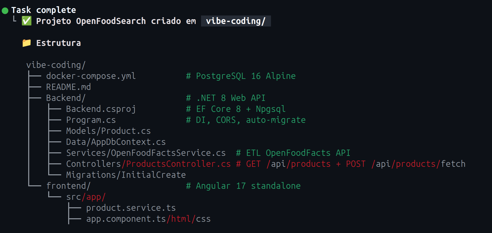
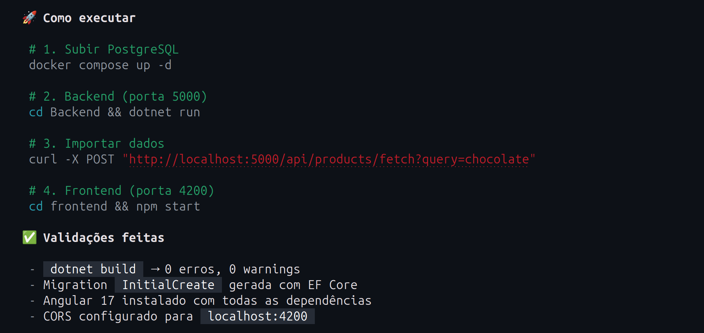

# Workshop: Agentes de IA para Programação
## Engenharia de Agentes com .NET Core, Cloud e MCP

---

# Objetivo do Workshop

- Construção assistida por IA de um pipeline completo.
- Foco em eficiência de tokens e arquitetura escalável.
- Aplicação prática de Model Context Protocol (MCP).

---

# Escopo do Projeto (ETL & Busca)

- **Fonte de Dados:** Extração e sanitização do Open Food Facts API.
  - https://openfoodfacts.github.io/openfoodfacts-server/api/
- **Backend:** API REST em .NET Core.
- **Frontend:** Interface simples para busca de produtos.
- **Infraestrutura:** Provisionamento via Azure CLI e deploy em Kubernetes (AKS).

---

# Estrutura do Repositório

```text
workshop-agentes-ia/
├── how-to/
│   └── images/
├── vibe-coding/
│   ├── Backend/
│   └── frontend/
└── agentic-engineering/
```

---

# Agentic Engineering
## A nova fronteira do desenvolvimento assistido por IA

---

# O Risco do "Vibe Coding"

- **Abordagem:** "Eu não preciso saber, a IA faz por mim".
- **Interface:** Interação: Reativa, baseada em prompts e correções sucessivas.
- **Problema:** Baixo controle arquitetural e visão de túnel.
- **Riscos:** Alucinação de código e acúmulo de débito técnico invisível.
- **Consequência:** Dependência de resultados "mágicos" sem entendimento do sistema.

---

# Agentic Engineering

- **Abordagem:** O desenvolvedor é o maestro (*Architect-in-the-loop*).
- **Interface:** CLIs, MCPs e ferramentas especializadas em pipelines.
- **Foco:** Estruturação de tarefas, quebra de complexidade e metas claras.
- **Vantagem:** A IA atua como multiplicador de força técnica.

**Resultado:**  
Código previsível, controlado e com decisão técnica ainda na mão de quem desenvolve.

---

# Comparativo: Vibe vs. Agentic

| Característica | Vibe Coding | Agentic Engineering |
| :--- | :--- | :--- |
| **Postura** | Reativa (Esperar a IA resolver) | Proativa, guiando a IA no que fazer e como fazer |
| **Contexto** | Limitado à sessão atual | Contexto, regras e padrões orientados pelo desenvolvedor |
| **Execução**| IA executa com pouca supervisão | Execução guiada e validada |

---

# Como a IA "Pensa": Janela de Contexto

* Os LLMs trabalham dentro de uma janela limitada de tokens.
* Fazendo um "mal comparado", é como se existisse um RAG interno
* O prompt do usuário orienta o modelo sobre qual resposta é mais relevante.
* Muitas vezes até o contexto da própria sessão ativa perde relevância
* Algo importante pode ser ignorado ou o famoso looping "faz-desfaz-refaz-desfaz"


---

# RAG vs. O Mecanismo Real das LLMs

* **RAG ou Retrieval-Augmented Generation:** Busca informações em fontes externas e adiciona esse conteúdo ao contexto antes de gerar a resposta.
* **O mecanismo real:** A LLM já foi previamente treinada e usa mecanismos de atenção para relacionar os *tokens* presentes na Janela de Contexto e entender quais informações são mais relevantes naquele momento.

**A ilustração do "RAG interno":** Não existe um RAG acontecendo dentro da LLM. A comparação anterior serve apenas para visualizar a ideia de que algumas informações do contexto acabam tendo mais influência que outras durante a geração.


---

# O Limite do Contexto em Projetos Corporativos

- Os sistemas corporativos possuem bases de código e regras de negócio massivas.
- **Custo e Limitação:** Processar a totalidade de um repositório a cada *prompt* é computacionalmente caro e ineficiente.
- **Degradação de Dados:** À medida que o volume de contexto aumenta, informações relevantes podem ser truncadas, resumidas ou utilizadas de forma menos eficiente pelo modelo.
- **O modelo perde a visibilidade global do sistema:** Começa a focar apenas no fragmento de código imediato ou usa um contexto geral incompleto.

---

# O "Efeito Dumbledore" na IA

<div class="columns">

<div class="col-text">

> "Como já provei a você também, erro como qualquer outro homem. De fato, sendo, perdoe-me, bem mais inteligente que a maioria, os meus erros tendem a ser proporcionalmente maiores."

- Modelos de IA possuem capacidade massiva de geração e abstração de código.
- Sem restrições rígidas, a magnitude do erro acompanha o poder do modelo.
- O resultado de um direcionamento vago não é um pequeno *bug* de sintaxe, mas uma falha arquitetural profunda.

<div class="reference">
  <b>Referência Bibliográfica:</b><br>
  Rowlling, J. K. <br>
  <i>Harry Potter e o Enigma do Príncipe.</i><br>
  Capítulo 10 — "A Casa de Gaunt"
</div>

</div>

<div class="col-image">
  
</div>

</div>

---

# A Falha do "Vibe Coding" em Larga Escala

- **Alucinações:** A IA inventa métodos, classes ou dependências para preencher o vazio de contexto.
- **Redundância:** Repetição de código estrutural por não conseguir ver abstrações já criadas em outras pastas.
- **Simplificação Excessiva:** Conforme o código cresce, a LLM poderá (e vai) ignorar integrações, outras partes da aplicação, outros sistemas e assim por diante.

**Conclusão:**  
Na prática, quanto maior o repositório e mais complexo o sistema, maior tende a ser o número de falhas quando não existe gestão explícita de contexto e escopo.

---

# Então "Vibe Coding" não funciona?

- **Funciona para cenários restritos e específicos:**
  - Validação rápida de hipóteses.
  - Geração de testes em massa.
  - Desenvolvimento de Provas de Conceito (POCs).
  - Aplicações muito simples e sem integrações sistêmicas.

**Veredito:**  
É uma abordagem muito útil quando aplicada à situação correta.

---


<div class="columns">

<div class="col-text">
  <h1><i>"Pra quem só tem martelo, tudo é prego"</i></h1>
</div>

<div class="col-image">
  
</div>

<div class="reference">
  <b>Referência:</b><br>
  <i>Ditado popular</i><br>
</div>

</div>


---

# O "Vibe Coding" na Prática

- **Objetivo:** Tentar construir a solução completa em uma única iteração.
- **Abordagem:** Execução do "Mega-Prompt" diretamente na CLI.
- **O Risco:** Sobrecarga de contexto. O agente assume múltiplas responsabilidades (Infraestrutura, Backend, Frontend) simultaneamente, aumentando o risco de alucinações, falhas de integração e configurações inconsistentes.

---

### Prompt (1/3)

<pre>
Atue como um Engenheiro de Software Full-Stack. Preciso que você crie um projeto completo chamado "OpenFoodSearch" a partir do zero, contendo um backend em .NET Core, um banco de dados local e um frontend em Angular. Crie toda a estrutura de pastas, arquivos e execute os comandos necessários na CLI.

Aqui estão os requisitos detalhados:

1. INFRAESTRUTURA E BANCO DE DADOS:
- Crie um arquivo `docker-compose.yml` na raiz do projeto que suba uma instância do PostgreSQL (com usuário, senha e banco de dados padrão configurados).
</pre>

---


### Prompt (2/3)
<pre>
2. BACKEND (.NET Core):
- Crie um projeto Web API em .NET (versão 8 ou a mais recente disponível).
- O backend deve consumir a API pública do Open Food Facts: `https://openfoodfacts.github.io/openfoodfacts-server/api/v2/search`
- Crie um Worker Service ou uma rota de "Carga Inicial" que busque uma lista de produtos nessa API externa.
- Faça uma transformação simples (ETL) nos dados retornados: extraia apenas os campos `code` (código de barras), `product_name` (nome), `brands` (marca) e `categories` (categorias). Descarte o resto do JSON complexo.
- Configure o Entity Framework Core para salvar esses produtos processados no PostgreSQL criado no Docker.
</pre>

---


### Prompt (3/3)
<pre>
- Crie um endpoint REST (`GET /api/products`) que permita buscar os produtos que já estão salvos no banco local, permitindo um filtro simples pelo nome do produto. Configure o CORS para permitir requisições do frontend.

3. FRONTEND (Angular):
- Gere um projeto Angular moderno na pasta `/frontend`.
- Crie um serviço para consumir o endpoint `GET /api/products` do backend.
- Crie uma página de busca contendo um campo de texto (input), um botão "Buscar" e uma tabela para exibir os resultados (Código, Nome, Marca e Categoria).
- Aplique uma estilização básica com CSS puro ou Bootstrap para não ficar feio.

Por favor, crie as pastas, os arquivos de projeto, os códigos-fonte e os scripts de inicialização de uma só vez.
</pre>

---

# Resultado da Execução: Estrutura



---

# Resultado da Execução: Instruções



---

# A Colcha de Retalhos

* **A Ilusão do Sucesso:** Tudo parece pronto. *Build* verde, dependências instaladas, banco criado, migrations aplicadas.
* **A Realidade:** Quando a solução roda de verdade, os problemas começam a aparecer.
* **Perda de Controle:** Como a IA tomou várias decisões de uma vez, fica difícil entender exatamente o que foi criado e como as partes se conectam.

**Resultado:**  
Você não construiu uma solução.  
Você acumulou pedaços de código que agora precisa entender.

---

# A Barreira do Conhecimento

* **Sem conhecimento técnico:** A pessoa simplesmente não sabe por onde começar.
* **Com algum conhecimento:** Começa o looping clássico: copia o erro, manda para a IA, aplica a correção, aparece outro erro...
* **E depois de algumas rodadas:** Já não está claro se a IA está corrigindo o problema ou alterando partes que antes funcionavam.

**Resumo:**  
O problema deixa de ser corrigir o código.  
Passa a ser entender o que a IA fez.

---

# "Task Complete" engana

* A IA encerrou a execução dizendo que a tarefa estava concluída.
* O backend compilou, o banco subiu e as migrations foram aplicadas.
* Mas a integração externa falhou durante a execução.
* O frontend também apresentou erro quando efetivamente executado.
* Nenhuma validação de ponta a ponta havia sido feita.

**Resultado:**  
O agente validou partes isoladas e concluiu que o sistema inteiro estava pronto.

---

# Erros Bizarros — Parte 1

* **Erro virou sucesso:** Falha no ETL → `200 OK`.
* **God Service:** HTTP + ETL + banco + logs na mesma classe.
* **N+1 no banco:** Consulta por produto antes de salvar.
* **Credenciais no código:** `appsettings` + fallback no `Program.cs`.
* **Zero resiliência:** API externa sem retry/backoff.

---

# Erros Bizarros — Parte 2

* **Angular 17 em 2026:** Projeto já nasce defasado.
* **`localhost` hardcoded:** Configuração presa no código.
* **Entidade = contrato:** EF exposto direto para o frontend.
* **`AppComponent` faz tudo:** Busca, estado, ETL e mensagens.
* **Zero i18n:** Textos todos hardcoded.

---

# Então a IA não sabe fazer?

* **Conhecimento genérico:** Sem direção explícita, o modelo tende a recorrer ao seu conhecimento genérico e ao contexto disponível.
* **Qualidade de "Trabalho de Faculdade":** O código atende ao requisito imediato e básico, mas ignora padrões de engenharia corporativa.
* **A Ponta do Iceberg:** Os erros listados anteriormente representam apenas os sintomas superficiais de falhas arquiteturais mais profundas.
* **"Estar Funcionando" vs. Ser Funcional:** Compilar e rodar não garante escalabilidade, segurança ou manutenibilidade.
* **Causa Raiz:** A falta de direcionamento, contexto e restrições.

---

# Mantenha a sua Empregabilidade

* **O Risco da Dependência:** Delegar decisões críticas à IA cria lacunas severas no seu conhecimento técnico.
* **O Cenário da Entrevista:** Como você justificará suas decisões em uma avaliação? A resposta não pode ser: *"Eu sei fazer, mas preciso abrir o meu agente CLI"*.
* **O Papel da Ferramenta:** Agentes são multiplicadores de produtividade e velocidade, não substitutos do seu conhecimento.

---

# Tenha sempre em mente

**A Regra de Ouro:**  
Ao finalizar qualquer entrega, faça a si mesmo a pergunta definitiva:  
*"Eu consigo explicar, defender, corrigir e suportar o que a IA acabou de fazer?"*  

**Você ainda é um programador:**  
Usar um acelerador não pode transformar você em um especificador funcional de prompts preso em loopings de tentativa e erro.

---

# Próxima Sessão: Fazendo do Jeito Certo

* **Definir o produto:** O que estamos construindo, para quem, quais regras, limites e critérios de sucesso.
* **Definir a persona:** Backend, frontend, Kubernetes e cloud exigem conhecimentos diferentes. Cada contexto deve ter o especialista certo.
* **Criar o `AGENT.md`:** Instruções, padrões, restrições e diretrizes de cada subprojeto, alinhados à sua respectiva persona.
* **Skills, Plugins e MCP:** Como ampliar as capacidades do agente e fornecer ferramentas, contexto e integrações de forma controlada.


---

## continuando...

* **Documentation-first:** Arquitetura, contratos, dados, integrações e decisões documentados antes da primeira linha de código.
* **Engenharia antes da geração:** Guardrails, parametrização externa, arquitetura, responsabilidades, Design Patterns e Orientação a Objetos.
* **Testes Unitários:** Como estruturar, validar e usar a IA sem cair no “teste que só testa o mock”.
* **Testes Integrados e de Carga:** Onde a capacidade de geração e análise das LLMs começa a virar uma vantagem enorme.


Agora não vamos pedir para a IA construir o sistema.  
Vamos preparar o sistema para que a IA consiga construí-lo direito.

---

# Github do Workshop

<div class="github">


[github.com/expertos-tech/workshop-agentes-ia](https://github.com/expertos-tech/workshop-agentes-ia)

</div>

---
# Cereja do bolo

**Não acredite em mim. Teste você mesmo.**

Essa apresentação foi 100% construída com apoio de IA.

Mas e se, em vez de toda essa discussão, revisão e direcionamento, eu simplesmente entregar os tópicos para uma IA e pedir:

> **"Crie meu workshop."**

Use exatamente o mesmo prompt no ChatGPT, Gemini, Claude, Copilot ou qualquer outra LLM e compare o resultado.

No repositório do GitHub, o prompt está em:  
`how-to/crie-meu-workshop.md`